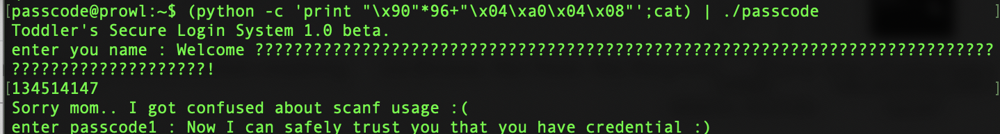
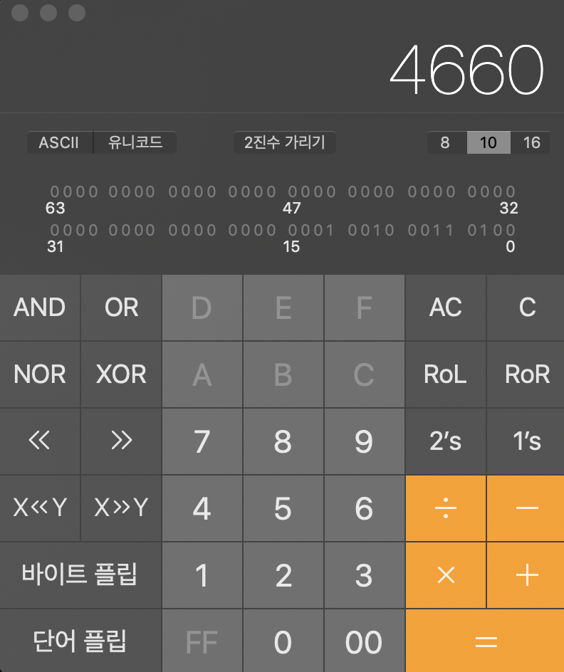

2019.08.23(sat)
author : won

** md 파일에 이미지 넣기: ref - https://zeddios.tistory.com/34

1. File Descriptor 란?
리눅스에서는 파일이 오픈되고 나면 file descriptor라는 일종의 Index 번호가 반환됨.
FD 는 파일을 오픈한 프로세스의 고유 번호이다. 

프로세스마다 관례적으로 0,1,2 은 사전 배정되어 있는데 
0 : 표준 입력(stdin)
1 : 표준 출력(stdout) 
2 : 표준 오류(stderr)

* reference : http://noplanlife.com/?p=1211

2. 문제 풀이 

len = read(fd, buf, 32);
// fd 파일을 열어서 32바이트만큼 읽어서 buf로 복사

fd 의 0,1,2 즉 표준 입력, 표준 출력, 표준 오류를 이용하여 문제를 푼다.
보통 풀이에서는 fd 를 0으로 만들어서 문제를 풀지만, 실제로는 fd를 1 또는 2로 만들어도 문제 해결이 가능
왜냐하면 fd를 1,2로 하는 경우 입력을 받을 수 있으며, 표준 출력으로 원하는 값 "LETMEWIN" 이 나타나기 때문에 fd 가 출력된 값을 읽어온다. 

따라서 argv 에 0x1234 --> 4660 , 4661, 4662 를 입력하면 다음과 같이 flag 값을 볼 수 있다.

(+) 꿀팁: MAC 에서 공학용 계산기 사용하기
계산기 어플을 키고 "command + 3"입력하면 공학용 계산기 사용 가능!

