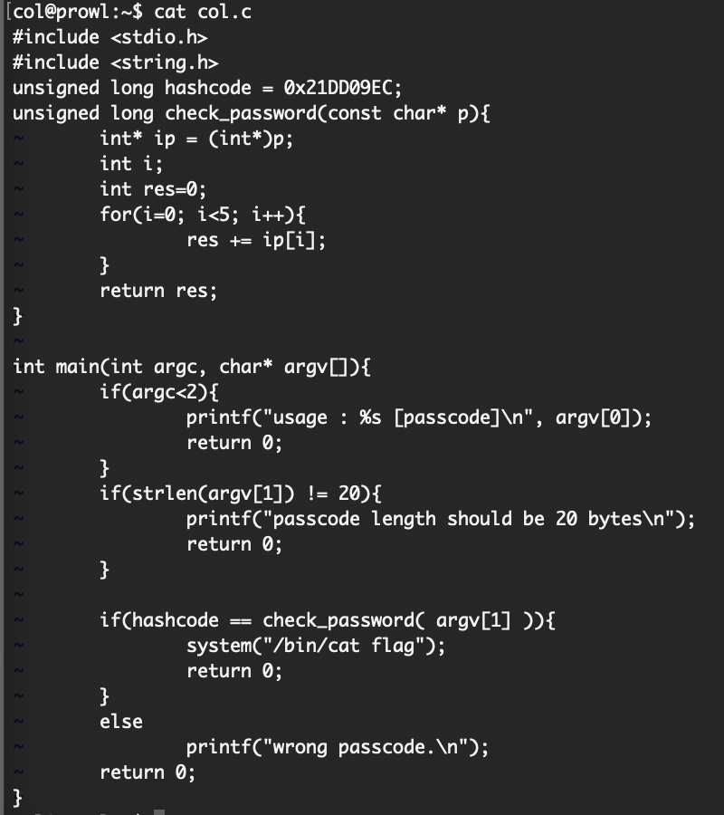
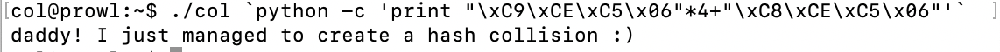

2019.08.23(sat)
author : won

**MD 사용법 총정리 : <https://heropy.blog/2017/09/30/markdown/>

<pre><code>
unsigned long check_password(const char* p){
	int* ip = (int*)p;
	// 함수 인자 char형 포인터 p를 int형 포인터로 변경하여 ip 에 대입
	int i;
	int res=0;
	for(i=0; i<5; i++){
		//ip[0], ip[1] .. 이라면 int 형의 크기인 4바이트만큼씩 이동함.
		res += ip[i];
	}
	return res;
}
</code></pre>

<pre><code> 
	if(hashcode == check_password( argv[1] )){
		system("/bin/cat flag");
		return 0;
	}
</code></pre>

20자를 5번에 나누어, 즉 4개 숫자씩 나누어서 더한 값이 0x21DD09EC 가되어야 합. 
0x21DD09EC = 0x6C5CEC8 * 5 + 4
5의 배수가 아니기 때문에 나머지 4가 나옴
따라서 0x6C5CEC9 * 4 + 0x6C5CEC8 을 해야함.

입력 방법 : ./col `python -c 'print "\xC9\xCE\xC5\x06"*4+"\xC8\xCE\xC5\x06"'`

