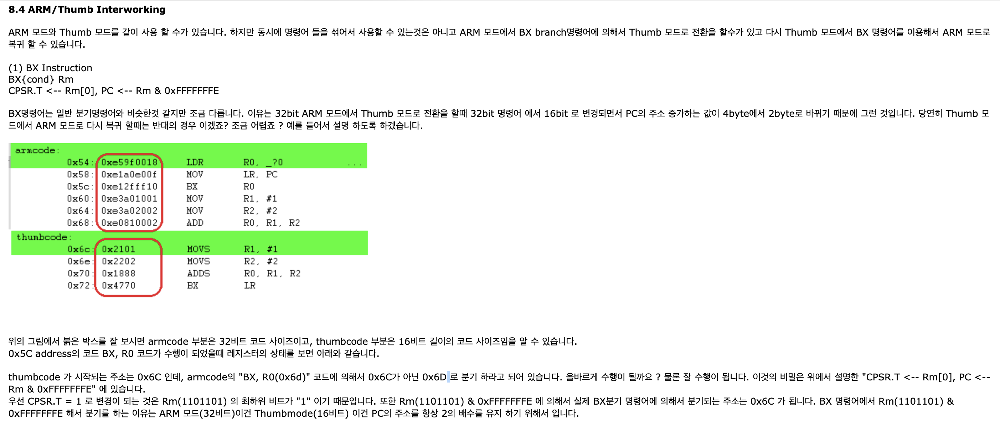

2019.08.25 (sun)

reference :
1. <https://code1018.tistory.com/176>
2. ARM Assembly 정리 - ARM 기본 개녕.  <https://hyunmini.tistory.com/80> 
3. 풀이 youtube : <https://www.youtube.com/watch?v=qw8lKmkipug> <b> very helpful!!!! </b>
#ARM 공부!

## ARM(Advanced Risk Machine)
* 모바일에 주로 쓰이는 ARM 프로세서 
* 모바일/임베디드 등 PC 와는 다른 환경에 맞춰서 설계 --> 저전력
	* ARM 모드 
		- 레지스터 : R0 - R15 // 16개
		- 기계어 코드 길이 : 32비트 
	* Thumb 모드	
		- 레지스터 : R0 - R7 // 8개
		- 기계어 코드 길이 : 16비트

	<b>--> 쉘코드를 작성할 때에는 바이트 수를 줄이기 위해 Thumb 모드로 작성하는 것이 좋음</b>

## Register
* x86보다 범용 레지스터의 수가 많으며 LR(link register) 가 존재함.
	* R0 ~ R12 : 범용 레지스터, 인자값 및 임시 계산 저장소
	* R13(SP) : Stack Pointer = ESP
	* R14(LR) : Link Register, 함수 호출전 LR에 리턴 주소를 저장하고 점프 (SFP 사용X)
	* PC : program counter로 다음에 실행할 코드의 주소 저장= EIP 
		아래에 따르면 PC는 ARM 에서는 현재 실행 주소의 +8byte, thumb에서는 현재 실행 주소의 +4byte를 저장하고 있음.
<https://stackoverflow.com/questions/24091566/why-does-the-arm-pc-register-point-to-the-instruction-after-the-next-one-to-be-e> 

<http://infocenter.arm.com/help/index.jsp?topic=/com.arm.doc.dui0204ik/CEGIBCCG.html>

<http://www.jkelec.co.kr/img/lecture/arm_arch/arm_arch_4.html>

key = key1() + key2() + key3()

key1() = pc = \x8ce4
key2() = r3 
	= r3 + 4
	= pc + 4
	= 8d08 + 4
	= \x8d0c
key3() = \x8d80

key = \x8ce4 + \x8d0c + \x8d80
    = 108400

